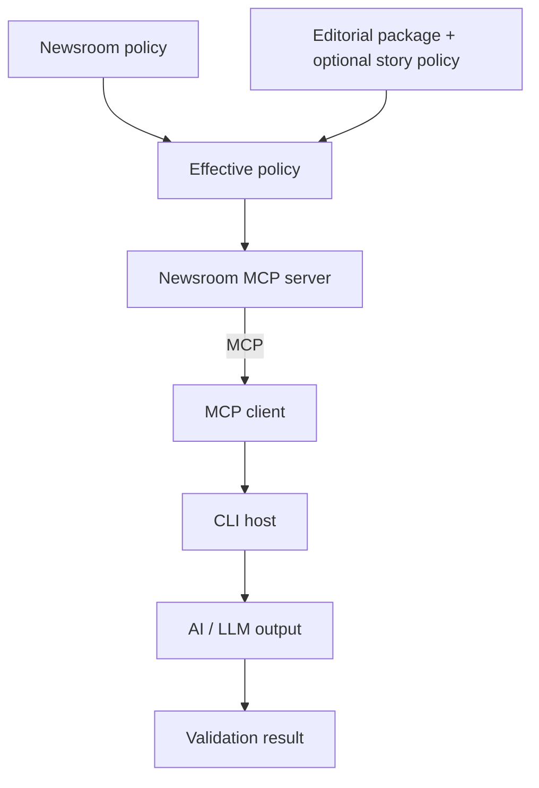

# Newsroom MCP

Newsroom MCP is a deliberately small Python prototype that keeps journalism separate from the rules governing its use. It asks:

> Can journalism be exposed to AI agents as structured editorial packages containing not only facts, but also the editorial context necessary to use those facts responsibly?

It also tests whether a newsroom can communicate machine-readable policies that meaningfully constrain downstream LLM output—preserving framing boundaries, disclosures, factual integrity, material context, quotations, and editorial confidence—and which rules belong at newsroom versus story level.

This prototype tests communication and server-side validation of editorial standards. It is **not DRM**, and it cannot guarantee what an arbitrary downstream system does after retrieving information.

## Architecture

- **Newsroom policy**: publisher-wide structured rules, stored once.
- **Editorial package**: a story's facts, evidence, framing, disclosures, quotes, chronology, confidence, judgment, and media provenance.
- **Story policy**: optional requirements or restrictions that only add to or tighten newsroom rules.
- **Effective policy**: the server-produced union of newsroom and story constraints, with source versions.
- **MCP server**: the newsroom/publisher and validation boundary.
- **MCP client**: the reusable protocol consumer.
- **MCP host**: the CLI application coordinating inspection and proposed-use validation.



The validator expects a proposed use to declare the fact IDs, disclosures, framing IDs, quotations, confidence labels, and policy-sensitive actions it uses. This makes the demo deterministic and auditable; it is not an NLP claim that the rendered prose has been fully understood.

## Installation

Python 3.10 or newer is supported. No API keys or environment variables are required.

```bash
git clone https://github.com/hadalulu/bespoke_mcp.git
cd bespoke_mcp
python -m venv .venv
source .venv/bin/activate
python -m pip install -e ".[dev]"
```

On Windows PowerShell, activate with:

```powershell
.venv\Scripts\Activate.ps1
python -m pip install -e ".[dev]"
```

## Local usage

The stdio server is a protocol process: an MCP client normally starts it and communicates over standard input/output. To start it directly for an MCP-capable host:

```bash
newsroom-server
```

Do not type into that terminal; stdout is reserved for MCP messages. The included host launches its own server subprocess:

```bash
newsroom-host
```

The interactive flow displays `NEWSROOM POLICY`, `EDITORIAL PACKAGE`, `STORY-SPECIFIC POLICY`, `EFFECTIVE POLICY`, and `VALIDATION RESULT` separately. Run all predefined scenarios or one detailed scenario with:

```bash
newsroom-host --demo
newsroom-host --scenario rejected-disclosure
```

Run tests—including a real stdio client/server round trip—with:

```bash
pytest
```

The five MCP tools are `list_stories`, `get_newsroom_policy`, `get_editorial_package`, `get_effective_policy`, and `validate_usage`. The server also supplies natural-language server instructions during MCP discovery, while the JSON policy remains the machine-readable source of rules.

## Policy and validation model

The newsroom policy always applies. A story policy has only `additional_requirements` and `additional_restrictions`; models reject obvious override/removal vocabulary, and the merge only appends unique codes. The effective policy records both policy versions so clients do not need to implement inheritance.

The deterministic validator demonstrates missing disclosures, prohibited framing, unknown facts or claims, fabricated and altered quotes, material omissions, overstated confidence, and story restrictions. The fictional sample packages cover an emissions projection and an unsubstantiated allegation involving a minor.

## Deployment

This experiment uses local stdio, where the host launches one server subprocess. MCP also supports Streamable HTTP; `MCPServer.run(transport="streamable-http")` can expose that transport, but this repository intentionally does not claim production-ready HTTP deployment.

A real newsroom deployment would need authentication and authorization, secure transport, persistent storage, editorial-package and policy versioning, audit logs, access controls, monitoring, materially stronger validation, and legal/licensing terms outside model instructions. An HTTP service must also follow MCP transport security guidance, including origin validation and safe binding.

## Limitations

- MCP can communicate publisher-wide standards, editorial context, and structured constraints.
- The server can calculate an authoritative effective policy and enforce rules on operations performed through it.
- A cooperative host or LLM can interpret that policy when producing output.
- The prototype cannot guarantee how an arbitrary client uses information after receipt.
- Materiality, distortion, framing, and whether an omission changes interpretation often require editorial judgment.
- The validator checks declared structured elements, not every implication of natural-language prose; declarations from an untrusted client cannot be assumed truthful.
- Story-policy weakening prevention is intentionally simple, not a general policy engine.
- This is an experiment, not a complete rights-management or newsroom publishing system.
